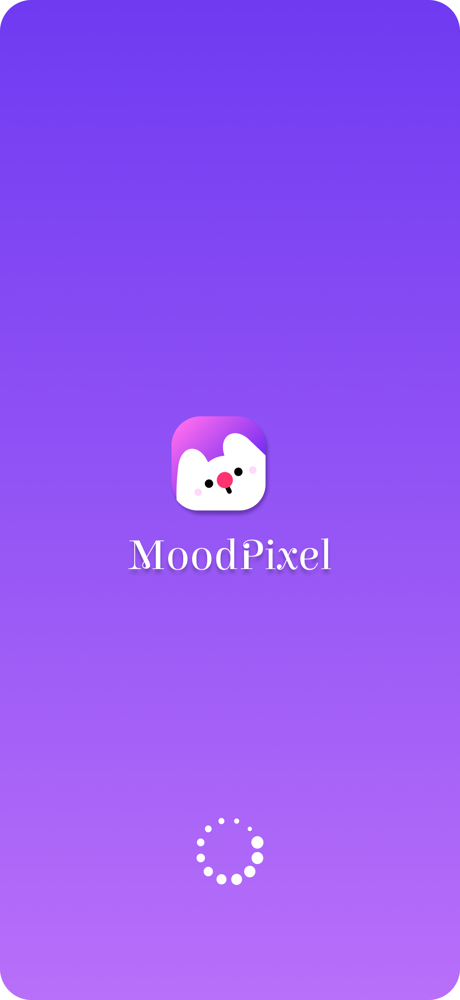
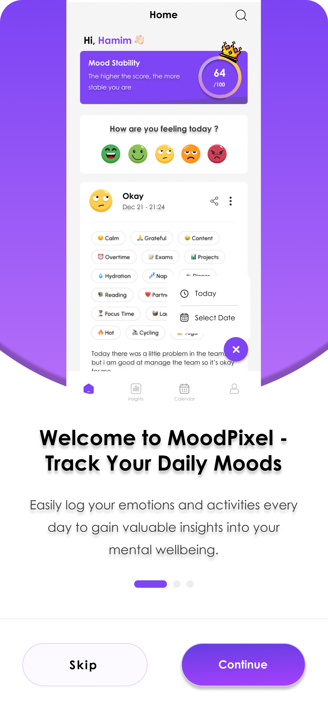
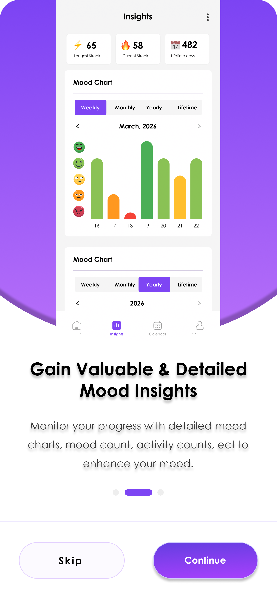
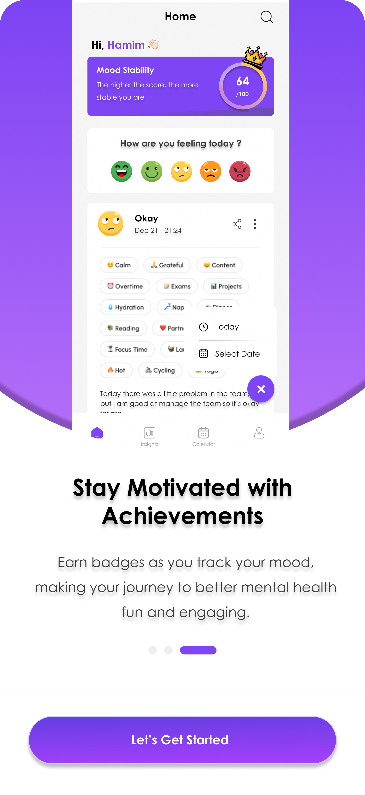
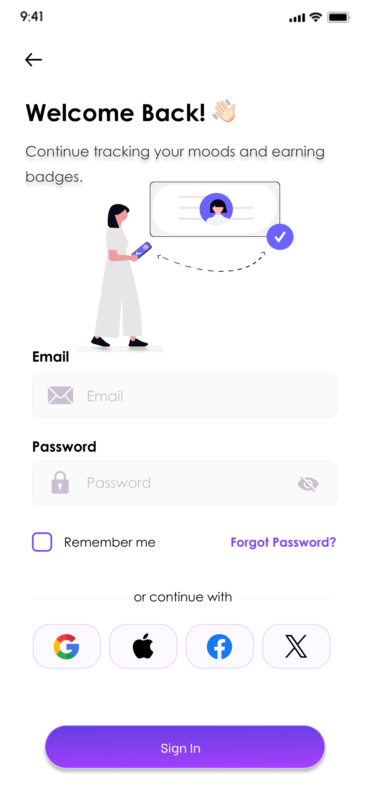

# MoodPixel-Project-UI

## Overview
MoodPixel is a mental health monitoring app UI project.  
This repository contains the project UI screenshots.

## Project Screenshots

### Logo Page

### Welcome Page

  
  
  

### Login Page

### Home Page

### Home Page

### Home Page

### Home Page

### Home Page

### Home Page

### Home Page

### Home Page

### Home Page

### Home Page

### Home Page

### Home Page

### Home Page

### Home Page

